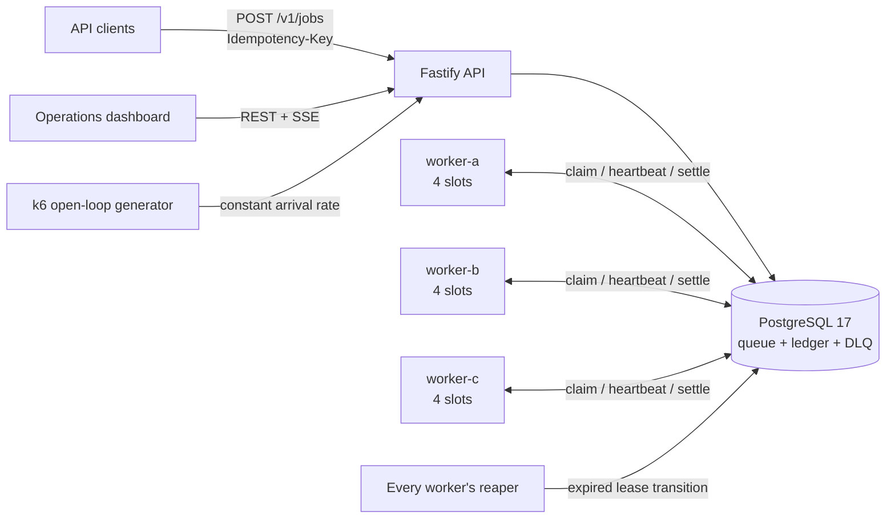
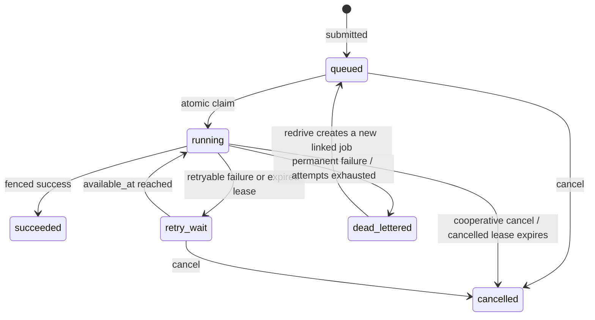

# QueueForge

QueueForge is a compact, working distributed background-job system built to expose the hard parts usually hidden by Celery or Sidekiq: durable submission, concurrent claiming, bounded retries, fencing leases, crash recovery, idempotency, dead letters, persistence, observability, and honest performance measurement.

The implementation is TypeScript/Node.js with PostgreSQL as the sole durable source of truth. The supplied Compose topology runs one API, three independently killable workers, and PostgreSQL. A responsive operations dashboard shows live data when the local API is reachable and clearly labels its built-in demo telemetry when it is not.

## Verified result

The checked-in evidence was produced on September 5, 2026—not estimated:

- 31/31 crash, fencing, idempotency, retry, DLQ, cancellation, and persistence assertions passed.
- Two different workers were hard-killed with SIGKILL while processing.
- The after-effect crash produced two handler executions, two attempt visits, and exactly one durable logical effect.
- All nine formal k6 trials passed every HTTP and database correctness check with zero dropped iterations, zero HTTP failures, and zero container restarts.
- At 50 offered jobs/s, median completion goodput was 49.6/s with 6.3 ms submit p95 and 108.9 ms end-to-end p95.
- At 150 and 300 offered jobs/s, admission stayed at the requested rate while completion saturated near 107–109 jobs/s and backlog grew. That separation is intentional: admission capacity is not processing capacity.

Read the human reports or audit the raw JSON:

- [Crash-recovery report](evidence/recovery-proof.md)
- [Crash-recovery JSON](evidence/recovery-proof.json)
- [Benchmark report](evidence/benchmark-results.md)
- [Benchmark JSON](evidence/benchmark-results.json)
- [Raw trial evidence](evidence/raw/)

## Run it

Requirements: Docker Desktop with Linux containers, Node.js 22.13 or newer, and npm.

```bash
npm install
npm --prefix backend install
docker compose up -d --build
npm run dev
```

Open:

- Dashboard: `http://localhost:3000`
- API: `http://localhost:18080`
- Readiness: `http://localhost:18080/health/ready`
- Prometheus metrics: `http://localhost:18080/metrics`

The API and PostgreSQL ports bind to `127.0.0.1` only. The sample credentials are intentionally local-development credentials.

Submit a job:

```bash
curl -i http://localhost:18080/v1/jobs \
  -H 'Content-Type: application/json' \
  -H 'X-Client-Id: example' \
  -H 'Idempotency-Key: invoice-8742-v1' \
  --data '{
    "queue":"critical",
    "type":"flaky",
    "payload":{"fail_until_attempt":2,"duration_ms":100},
    "max_attempts":5,
    "timeout_ms":10000,
    "backoff_base_ms":250,
    "backoff_cap_ms":10000
  }'
```

The first response is `202 Accepted` with a `Location` header. Repeating the identical semantic request with the same idempotency key returns the original job as `200 OK`; changing the request while reusing the key returns `409 Conflict`.

Stop the stack without deleting its durable volume:

```bash
docker compose stop
```

`docker compose down -v` intentionally destroys the PostgreSQL volume and should only be used when a full data reset is wanted.

## Architecture



PostgreSQL owns every correctness decision. Workers use database time, never their own clocks, to claim, extend, expire, or settle a lease. There is no Redis/database dual-write gap and no in-memory queue that can disappear on process loss.

The atomic claim transaction selects ready rows with `FOR UPDATE SKIP LOCKED`, changes them to `running`, increments the monotonic lease generation, assigns a fresh secret token, inserts an attempt, and records a lifecycle event before committing. PostgreSQL explicitly identifies queue-like tables as a suitable use for `SKIP LOCKED`, while warning that it does not provide a globally consistent view ([PostgreSQL `SELECT`](https://www.postgresql.org/docs/current/sql-select.html)). QueueForge therefore promises best-effort priority/FIFO ordering, not strict global FIFO.

More detail: [architecture and invariants](docs/architecture.md).

## Delivery contract

QueueForge provides **durable at-least-once execution**.

It deliberately does not claim exactly-once delivery. A worker can commit an external effect and die before QueueForge persists success; the job must then be delivered again. This is the same boundary emphasized by Sidekiq’s guidance that jobs must be idempotent and transactional ([Sidekiq best practices](https://github.com/sidekiq/sidekiq/wiki/Best-Practices)).

QueueForge addresses the boundary in three separate layers:

1. Submission idempotency maps a scoped `Idempotency-Key` and canonical request fingerprint to one job for seven days.
2. Lease fencing prevents an expired worker from mutating QueueForge state. Every heartbeat and terminal transition must match job ID, opaque lease token, generation, current state, and a still-unexpired database-time deadline.
3. Handler idempotency prevents repeated execution from duplicating business effects. The demo sink uses `demo_effects(job_id PRIMARY KEY)` and `ON CONFLICT DO NOTHING`.

The first layer does not imply the third. An idempotent API request prevents duplicate job records; it cannot make an email, payment, or downstream API call exactly once. Stripe’s API similarly stores the result associated with an idempotency key and rejects conflicting reuse; QueueForge applies that pattern to job submission ([Stripe idempotent requests](https://docs.stripe.com/api/idempotent_requests)).

## State machine



`max_attempts` includes the first execution. Terminal rows are immutable. Redrive never edits or erases the original dead-lettered row; it creates a new job with `redrive_of_job_id` and an immutable link/event.

Retry delay after attempt `n` is:

```text
raw = min(cap, base × 2^(n−1))
delay = uniform random integer from 0 through raw
available_at = database_now + delay
```

This is capped exponential backoff with full jitter, used to avoid synchronized retry storms ([AWS Architecture Blog](https://aws.amazon.com/blogs/architecture/exponential-backoff-and-jitter/)). The chosen raw and jittered values are stored on the attempt and event.

## Built-in handlers

| Type | Purpose |
|---|---|
| `noop` | Optional delay, then success. Used for baseline load measurement. |
| `flaky` | Fails retryably through a requested attempt, then succeeds. |
| `always_fail` | Produces retryable or permanent failures for retry/DLQ tests. |
| `idempotent_counter` | Commits a unique durable effect, with controllable sleeps before and after it for deterministic crash windows. |

Handlers are an allowlist. Clients cannot submit an import path, source code, or shell command.

## Crash recovery proof

Run:

```bash
npm run proof:recovery
```

The harness fails nonzero if an assertion fails. It never removes the PostgreSQL volume and restores all worker services in `finally`.

The recorded passing run performed:

1. Twenty concurrent identical submissions: exactly one `202`, nineteen `200` replays, one job ID; conflicting key reuse returned `409`.
2. An isolated PostgreSQL fencing test: generation 1’s stale settlement was rejected after generation 2 claimed.
3. Crash after durable effect: worker-a exited 137; attempt 1 became `lease_expired`; worker-b claimed generation 2; the job succeeded after 15,048 ms; two visits produced one effect.
4. Crash before effect: worker-b exited 137; worker-c claimed generation 2; the job succeeded after 15,220 ms; only attempt 2 reached the effect.
5. A retryable poison job made exactly three attempts and entered the DLQ; idempotent redrive created a new job while preserving the source.
6. A running handler observed a cancellation request and settled `cancelled`.
7. Restarting the API container retained the job result, two attempts, and six events in PostgreSQL.

This proves recovery for the tested topology and fault windows. It does not prove that arbitrary external side effects are exactly once.

## Load results

The formal matrix used k6 2.0.0’s open-loop `constant-arrival-rate` executor. Open-loop arrival is important because it keeps offering work independently of response latency; overload appears as backlog or dropped iterations rather than quietly reducing offered traffic ([k6 constant-arrival-rate](https://grafana.com/docs/k6/latest/using-k6/scenarios/executors/constant-arrival-rate/)).

Each rate ran three times for 10 seconds after an excluded warm-up. The table reports medians and min–max ranges:

| Offered | Admission RPS | Submit p95 | Submit p99 | Completion goodput | Queue wait p95 | End-to-end p95 | Peak backlog |
|---:|---:|---:|---:|---:|---:|---:|---:|
| 50/s | 50.1 (50.0–50.1) | 6.3 ms (6.2–7.5) | 8.2 ms (8.0–9.3) | 49.6/s (49.6–50.0) | 98.4 ms | 108.9 ms | 5 |
| 150/s | 150.0 | 6.2 ms (6.0–7.4) | 9.4 ms (7.9–11.7) | 109.5/s (108.5–109.8) | 3,519.0 ms | 3,524.9 ms | 378 |
| 300/s | 299.9 (299.9–300.0) | 8.0 ms (7.9–9.2) | 12.9 ms (11.3–21.5) | 107.1/s (107.1–108.6) | 17,036.1 ms | 17,047.3 ms | 1,789 |

All nine trials had zero dropped iterations, zero HTTP failures, 100% response-contract checks, matching generator/database counts, one attempt and one submitted/claimed/succeeded event per job, no failure transitions, one idempotency row per accepted job, and no container restarts.

Interpretation:

- The API admission path accepted the highest tested rate, 300/s, with low submit latency.
- The three-worker/12-slot execution plane’s observed saturated goodput was about 107–109 zero-work jobs/s.
- 50/s was the highest tested point that drained essentially immediately. The gap between 50 and 150 means this run does not claim a precise sustainable maximum.
- Higher offered rates remained correct but accumulated queueing latency and backlog. “Accepted” is not the same as “finished.”

These are local single-machine results with a zero-work handler, no TLS/auth/WAN latency, and k6 sharing the Docker/WSL2 resource pool. They are reproducible development evidence, not production capacity promises.

Run the matrix again:

```bash
npm run bench
```

Override it with `BENCH_RATES`, `BENCH_REPETITIONS`, `BENCH_DURATION`, `BENCH_WARMUP_RATE`, or `BENCH_WARMUP_DURATION`.

## API surface

| Method | Route | Purpose |
|---|---|---|
| `POST` | `/v1/jobs` | Validate and durably submit a job. |
| `GET` | `/v1/jobs` | Cursor-paginated/filterable job ledger. |
| `GET` | `/v1/jobs/:id` | Job, attempts, and event timeline. |
| `GET` | `/v1/jobs/:id/events` | Cursor-style event stream for one job. |
| `POST` | `/v1/jobs/:id/cancel` | Immediate queued cancel or cooperative running cancel. |
| `GET` | `/v1/dead-letters` | Immutable dead-letter records. |
| `POST` | `/v1/dead-letters/:id/redrive` | Idempotently create a linked replacement job. |
| `GET` | `/v1/workers` | Worker incarnations, slots, queues, and heartbeat age. |
| `GET` | `/v1/dashboard/summary` | Counts, rate, latency percentiles, and timeline. |
| `GET` | `/v1/dashboard/events` | Server-sent summary events. |
| `GET` | `/v1/benchmarks/:runId` | Cohort-scoped database truth for benchmark verification. |
| `GET` | `/v1/demo/effects/:id` | Crash-demo effect and attempt visits. |
| `GET` | `/health/live` | Process liveness. |
| `GET` | `/health/ready` | Database readiness. |
| `GET` | `/metrics` | Prometheus exposition. |

See [API reference](docs/api.md).

## Verify it

```bash
# TypeScript build, unit tests, authored-source lint, and dashboard production build
npm run verify

# The above plus all real-PostgreSQL integration tests in a disposable database
npm run verify:full

# Recovery experiment and evidence regeneration
npm run proof:recovery

# Formal k6 matrix and evidence regeneration
npm run bench
```

`core:test:integration` creates a randomly named database, runs the tests there, and drops only that validated database. It never truncates the live QueueForge database.

## Project map

```text
app/                     operations dashboard
backend/src/api.ts       HTTP contract and validation
backend/src/store.ts     queue transactions and durable invariants
backend/src/worker.ts    worker supervisor, claims, heartbeats, reaper
backend/src/schema.ts    PostgreSQL schema and indexes
backend/src/handlers.ts  allowlisted demonstration handlers
docker-compose.yml       API + PostgreSQL + three workers + k6 profile
scripts/prove-recovery.mjs
scripts/run-benchmark.mjs
scripts/test-integration.mjs
load/k6-submit.js
evidence/                human and machine proof artifacts
docs/                    design, API, operations, testing, and plan
```

## Operational and security scope

This is a serious educational system and local portfolio artifact, not a turn-key public multi-tenant service. Before Internet exposure, add authentication/authorization, per-tenant quotas, secrets management, TLS at the edge, payload/result retention, encryption and backup policy, audit access controls, API rate limiting, and database high availability. Keep handler code trusted and allowlisted.

Single-node PostgreSQL, multi-region replication, arbitrary-code sandboxing, workflows/DAGs, cron scheduling, strict global FIFO, and exactly-once delivery are explicit v1 non-goals.

- [Operations runbook](docs/operations.md)
- [Security model](SECURITY.md)
- [Verification strategy](docs/testing.md)
- [Implementation plan and next phases](docs/implementation-plan.md)

## Why these mechanisms

- A job lease is analogous to a queue visibility timeout: if processing does not finish before the deadline, another consumer may receive the work ([AWS SQS visibility timeout](https://docs.aws.amazon.com/AWSSimpleQueueService/latest/SQSDeveloperGuide/sqs-visibility-timeout.html)). QueueForge adds token/generation fencing because it owns the database state transition.
- Partial indexes keep ready and expired-lease scans focused; PostgreSQL can use a partial index only when the query predicate implies its predicate ([PostgreSQL partial indexes](https://www.postgresql.org/docs/current/indexes-partial.html)).
- Histograms/percentiles are separated by latency plane—submit, queue wait, execution, and end-to-end—because a single average hides queue saturation. Prometheus likewise recommends histograms when server-side aggregation and quantiles matter ([Prometheus histograms](https://prometheus.io/docs/practices/histograms/)).
- Durable lifecycle events provide a machine-auditable history. OpenTelemetry’s messaging conventions distinguish producer, consumer, and processing operations, a useful future tracing model ([OpenTelemetry messaging spans](https://opentelemetry.io/docs/specs/semconv/messaging/messaging-spans/)).

## License

MIT. See [LICENSE](LICENSE).
